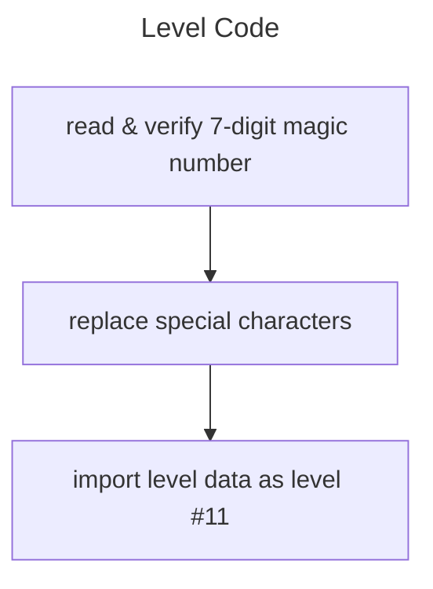
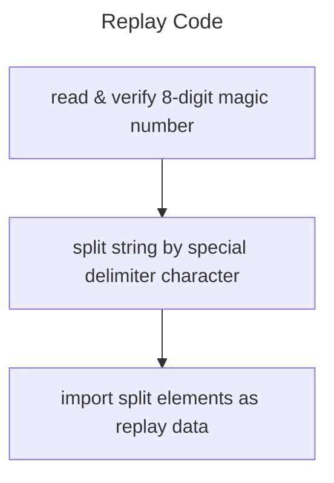

<!--
    created: October 19th, 2024
    updated: October 19th, 2024
-->

# codes





# magic number validation
```js
// for level codes
(code.slice(0, 7) - 1234567) == code.slice(7).length

// for replay codes
(code.slice(0, 8) - 12345678) == code.slice(8).length
```