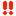
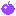

<!--
    created: June 17th, 2024
-->

# glossary

## gameplay

### entity
*see also: [entity.md](./entity.md)*

a game object that exists separately from the rest of a level, usually with the ability to think and interact with other entities.

## technical

### quarter tile
a quarter tile is simply 1/4th of a full tile.

### solidity check
the solidity check occurs whenever an [entity](#entity) wants to know if the [quarter tile](#quarter-tile) they're currently on, is solid or not. if a quarter tile's [solidity](#solidity) is greater than an entity's solidity, it's deemed to be solid. otherwise, it's not solid, and the entity will likely fall through it.

### solidity
solidity is a value assigned to tiles and [entities](#entity) that determines how solid or non-solid they are.

### mask card
a mask card is a visualization of a [tile mask](./tile-mask.md), as a card.

the flags at the bottom of a mask card are indicators of a tile's properties. so, the *Hue* (H) flag indicates the tile will be tinted by the level hues (`HUE` & `HUE #2`), the *Visible* (V) flag indicates the tile will be visible in-game, and the *Entity* (E) flag indicates the tile will spawn an entity.

the icons representing the kinds of quarter tiles also have their own meanings.

icon | name | meaning
---- | ---- | -------
|| blank | this quarter tile is non-solid and does nothing
 | solid  | this quarter tile is solid
 | danger / spikey | this quarter tile can hurt the player
 | conveyor | this quarter tile will move the player like a conveyor belt
 | active | this quarter tile will activate a full tile upon touch <!-- TODO: clarify what does it mean for a tile to become activated -->
 | stop | this quarter tile stops enemies and lifts from passing through
 | collect | unused, but was seemingly only used for apples