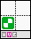
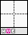
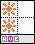
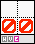
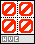
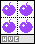

<!--
    created: June 20th, 2024
    updated: December 22nd, 2024
-->

# list of tiles
type | brush category # | name                                                  | mask        | [mask visual](./glossary#mask-visual) |
---- | ---------------- | ----------------------------------------------------- | ----------- | ------------------------------------- |
1    | -                | Air                                                   | `        `  |    |
2    | 1                | Full Ground Tile                                      | `5555   1h` |    |
3    | 1                | Eye Ground Tile                                       | `5555   1h` |    |
4    | 1                | Half Ground Tile                                      | `5005   1h` |    |
5    | 1                | Quarter Ground Tile                                   | `5000   1h` |    |
6    | -                | "BIG"                                                 | `5050   xh` |    |
7    | 3                | Half Ground Tile with Top Row of Spikes               | `5..5   3h` |    |
8    | 2                | Window                                                | `       2`  |    |
9    | 3                | Bottom Row of Spikes                                  | `.00.   3`  |    |
10   | 1                | Full Ground Tile without Right & Bottom Sides         | `5555   1h` |  |
11   | 4                | "Mob A1" Spawner Tile                                 | `    02 4`  |  |
12   | 2                | Stop Tile                                             | `111100 2`  |  |
13   | 1                | Stair Ground Tile                                     | `5055   1h` |  |
14   | 1                | Transparent Ground Tile                               | `5000   1`  |  |
15   | 5                | Apple (Yellow)                                        | `****   5`  |  |
16   | 2                | Stop Tile #2                                          | `100100 2`  |  |
17   | 1                | Inverted Full Ground Tile                             | `5555   1h` |  |
18   | 1                | Inverted Full Ground Tile with Dot                    | `5555   1h` |  |
19   | 4                | Saw Spawner Tile                                      | `    04 4`  |  |
20   | 1                | Inverted Full Ground Tile with Plus                   | `5555   1h` |  |
21   | 1                | Full Ground Tile with Plus                            | `5555   1h` |  |
22   | 2                | "out of shot" / Camera Stopper Tile                   | `    00 2`  |  |
23   | 6                | Horizontal Lift Spawner Tile                          | `    80 6`  |  |
24   | 6                | Vertical Lift Spawner Tile                            | `    81 6`  |  |
25   | 5                | Inactive Checkpoint                                   | `       5`  |  |
26   | 5                | Active Checkpoint                                     | `       5`  |  |
27   | -                | Active Checkpoint (Frame 3)                           | `        `  |  |
28   | -                | Active Checkpoint (Frame 4)                           | `        `  |  |
29   | -                | Active Checkpoint (Frame 5)                           | `        `  |  |
30   | -                | Active Checkpoint (Frame 6)                           | `        `  |  |
31   | 4                | Bird Spawner Tile                                     | `    06 4`  |  |
32   | 4                | Masher Spawner Tile                                   | `    82 4h` |  |
33   | 1                | Crushed Full Ground Tile                              | `5555   1h` |  |
34   | -                | Crumbling Platform                                    | `0660   6`  |  |
35   | -                | Crumbling Platform (Frame 2)                          | `0660    `  |  |
36   | -                | Crumbling Platform (Frame 3)                          | `0660    `  |  |
37   | -                | Crumbling Platform (Frame 4)                          | `0660    `  |  |
38   | -                | Crumbling Platform (Frame 5)                          | `0660    `  |  |
39   | -                | Crumbling Platform (Frame 6)                          | `0660    `  |  |
40   | -                | Crumbling Platform (Frame 7)                          | `        `  |  |
41   | -                | Crumbling Platform (Frame 8)                          | `        `  |  |
42   | 6                | Spring on Half Ground Tile                            | `5665   6h` |  |
43   | -                | Spring on Half Ground Tile (No Spring)                | `5555    h` |  |
44   | 6                | Eye Launcher Holder Ground Tile                       | `5555   6h` |  |
45   | 4                | Eye Launcher Spawner Tile                             | `    08 4`  |  |
46   | 6                | Crumbling Quarter Tile                                | `0600   6`  |  |
47   | -                | Crumbling Quarter Tile (Frame 2)                      | `0600   `   |  |
48   | -                | Crumbling Quarter Tile (Frame 3)                      | `0600   `   |  |
49   | -                | Crumbling Quarter Tile (Frame 4)                      | `0600   `   |  |
50   | 6                | Conveyor Belt on Ground Tile (Forward)                | `5775   6h` |  |
51   | 6                | Conveyor Belt on Ground Tile (Backward)               | `5775   6h` |  |
52   | -                | Conveyor Belt (Frame 1)                               | -           |  |
53   | -                | Conveyor Belt (Frame 2)                               | -           |  |
54   | -                | Conveyor Belt (Frame 3)                               | -           |  |
55   | -                | Conveyor Belt (Frame 4)                               | -           |  |
56   | -                | Conveyor Belt (Frame 5)                               | -           |  |
57   | -                | Conveyor Belt (Frame 6)                               | -           |  |
58   | 4                | Pip Spawner Tile                                      | `    09 4`  |  |
59   | 4                | Burtha Spawner Tile                                   | `    84 4`  |  |
60   | 7                | Micro Manager Spawner Tile                            | `    60 7`  |  |
61   | 4                | Worm (CCW) Spawner Tile                               | `    10 4`  |  |
62   | 4                | Worm (CW) Spawner Tile                                | `    11 4`  |  |
63   | 5                | End Flag                                              | `    11 4`  |  |
64   | -                | End Flag (Frame 2)                                    | -           |  |
65   | -                | End Flag (Frame 3)                                    | -           |  |
66   | -                | End Flag (Frame 4)                                    | -           |  |
67   | -                | End Flag (Frame 5)                                    | -           |  |
68   | 1                | Full Ground Tile without Right Side                   | `5555   1h` |  |
69   | 5                | Apple (Yellow) (Attach)                               | `    12 5`  |  |
70   | 5                | Key                                                   | `    00 5`  |  |
71   | 2                | Activate Tile                                         | `    00 2`  |  |
72   | 6                | Locked Key Door                                       | `6600   6`  |  |
73   | 6                | Vertical Lift with Bottom Stopper Spawner Tile        | `100181 6`  |  |
74   | 3                | Small Ground Tile with Spikey Sides                   | `....   3h` |  |
75   | 4                | Purple Mob Spawner Tile                               | `    13 4`  |  |
76   | 5                | Player Spawn                                          | `    00 5`  |  |
77   | 3                | Left Quarter Spike Tile                               | `.      3h` |  |
78   | 3                | Right Quarter Spike Tile                              | `   .   3h` |  |
79   | 2                | Hidden Full Ground Tile                               | `1111   2h` |  |
80   | 5                | Hidden Ground Tile with Apple (Yellow)                | `1111   5h` |  |
81   | 2                | Hidden Full Ground Tile with Bottom Half              | `5115   2h` |  |
82   | 2                | Hidden Full Ground Tile with Bottom-Left Quarter Tile | `5111   2h` |  |
83   | 3                | Thin Ground Slab with Top Row of Spikes               | `.00.   3h` |  |
84   | 2                | Activate Tile #2                                      | `111100 2`  |  |
85   | 5                | Apple (Red)                                           | `****00 5`  |  |
86   | 1                | Full Ground Tile without Left & Right Sides           | `5555   1h` |  |